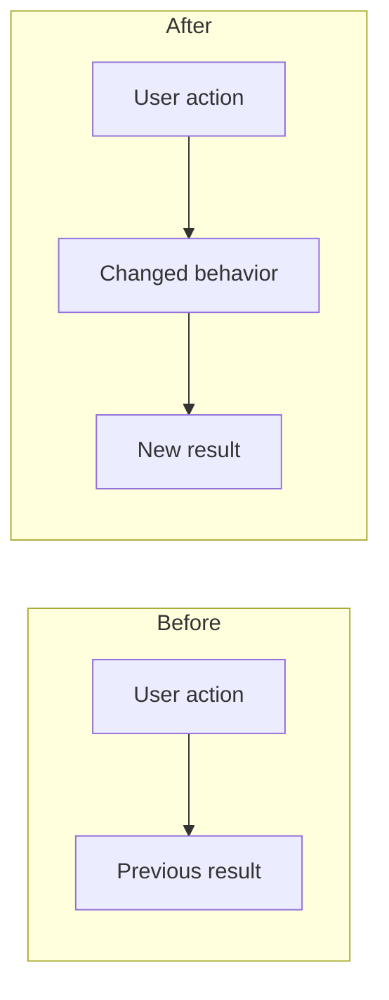
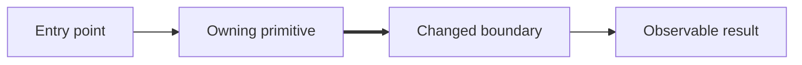

<!--
Write for a human maintainer and review agents.

Always keep Problem and outcome, Review guidance, Solution, and Validation.
Include conditional sections only when they add material information. Delete
unused sections and all instructional comments.

Lead with the problem and outcome, not an implementation inventory. Support
factual claims with code, tests, logs, traces, screenshots, or linked issues.
Do not write filler such as "N/A" merely to preserve a section. Link only
artifacts accessible to reviewers; never include local filesystem paths.
-->

## Problem and outcome

{Explain the original problem and why it matters in 1–3 sentences.}

- **Outcome:** {What is observably different after this PR.}
- **Invariant:** {What must remain true across every acceptable implementation.}
- **Scope boundary:** {What intentionally did not change.}
<!-- For bugs only. Delete otherwise. -->
- **Root cause:** {For bugs only: the proven cause, not the visible symptom.}

## Review guidance

- **Feedback requested:** {Correctness, architecture, security, UX, migration, naming, or a specific question.}
- **Start here:** `{path:line}` — {Why this is the load-bearing change.}
- **Review order:** {Short ordered path through the important files or commits.}
- **Lower-attention areas:** {Generated or mechanical changes and the evidence that verifies them.}
- **Known risk or uncertainty:** {Concrete concern, or `None`.}

## Solution

{Explain how the change produces the outcome. Focus on behavior, ownership,
contracts, and the existing primitive being reused or extended. Explain why this
is the smallest coherent solution when that decision is not obvious.}

<!-- Include when observable user, operator, or system behavior changes. -->
## Behavior change

| | Before | After |
|---|---|---|
| **Observable behavior** | {Previous behavior} | {New behavior} |
| **Failure behavior** | {Previous failure} | {New failure or recovery} |

<!--
Include when an interaction or operational journey changes. Prefer one compact
Mermaid before/after diagram. Add screenshots or video for visible UI changes.
-->
### User flow

<!--
Include when module boundaries, ownership, state, persistence, data flow,
external dependencies, or public contracts change. Diagram only the relevant
architecture, not every touched file.
-->
## Architecture

### Changed seams

| Boundary or contract | Change | Evidence |
|---|---|---|
| `{producer → consumer}` | {New, removed, or modified behavior} | `{path:line}`, test, trace, or linked specification |

## Validation

- `{actual command}` — {result} — proves {behavior or invariant}.
- {Runtime, manual, visual, log, or trace evidence when applicable.}
- **Not verified:** {Concrete missing verification and why. Use `Nothing material` only when all outcome-relevant behavior is covered, and say why.}

<!-- Keep only applicable rows. Delete this section when none apply. -->
## Delivery considerations

| Concern | Impact and required action | Evidence |
|---|---|---|
| Compatibility / migration | {Existing behavior or data transition} | {Evidence} |
| Security / permissions / data | {Changed exposure and mitigation} | {Evidence} |
| Rollout / rollback | {Release posture and safe reversal} | {Evidence} |
| Observability | {How regressions become visible} | {Evidence} |
| Documentation / communication | {Material that changed or must change} | {Evidence} |

<!-- Delete unused link types. Omit this section when there are no related items. -->
## Links

- Closes #
- Related #
- Depends on #
- Supersedes #
